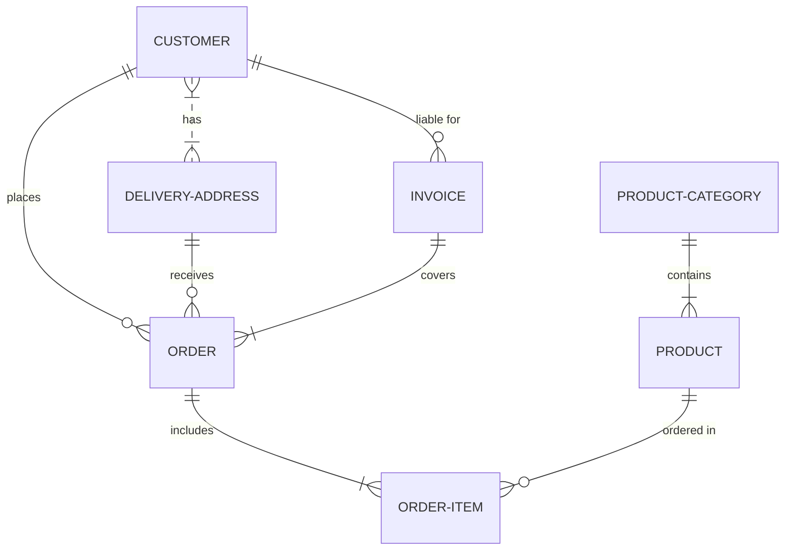

## CAPÍTULO IV: DESARROLLO DEL TEMA / PRESENTACIÓN DE RESULTADOS 

Maecenas molestie lacus tincidunt, placerat dolor et, ullamcorper erat. Mauris tortor nisl, ultricies ac scelerisque nec, feugiat in nibh. Pellentesque interdum aliquam magna sit amet rutrum. 

### Diagrama conceptual (opcional)
Ejemplo usando Live Editor https://mermaid.js.org/ (ejemplo opcional)

### Diagrama relacional

### Diccionario de datos

Acceso al documento [PDF](doc/diccionario_datos.pdf) del diccionario de datos.

### Desarrollo TEMA 1 "----"

Fusce auctor finibus lectus, in aliquam orci fermentum id. Fusce sagittis lacus ante, et sodales eros porta interdum. Donec sed lacus et eros condimentum posuere. 

> Acceder a la siguiente carpeta para la descripción completa del tema [scripts-> tema_1](script/tema01_nombre_tema)

### Desarrollo TEMA 2 "----"

Proin aliquet mauris id ex venenatis, eget fermentum lectus malesuada. Maecenas a purus arcu. Etiam pellentesque tempor dictum. 

> Acceder a la siguiente carpeta para la descripción completa del tema [scripts-> tema_2](script/tema02_nombre_tema)

... 